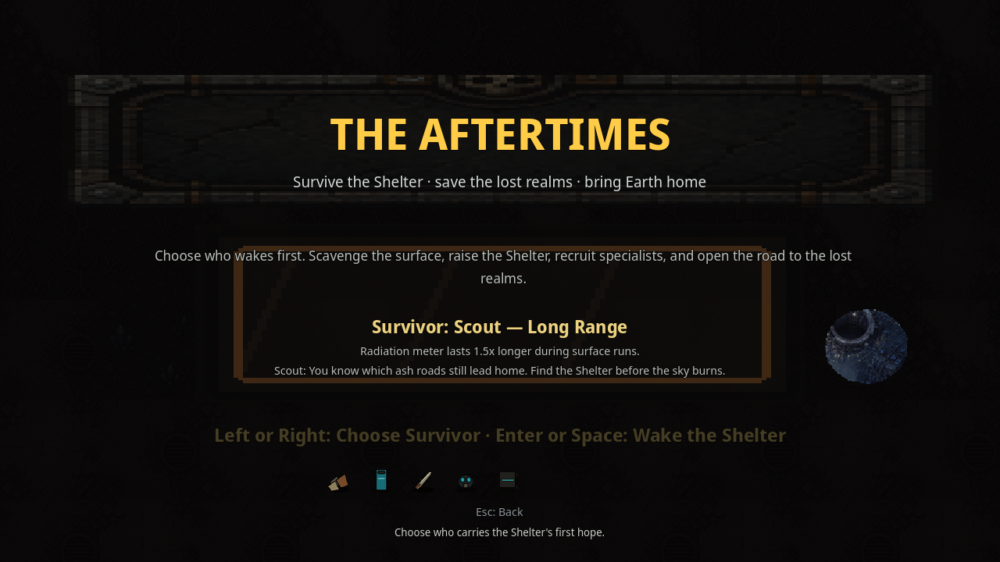

# Realm 1 Public Release Class Select Smoke

Status: public release title-to-class-select UI smoke proof. This does **not** replace external unaided QA, art/audio review, or legal/store approval.

Verified on 2026-07-03 from the public support-repo release zip after redownload and SHA check:

- Release: <https://github.com/elias-leslie/the-aftertimes-support/releases/tag/realm1-review-d3fc7d09>
- Asset: <https://github.com/elias-leslie/the-aftertimes-support/releases/download/realm1-review-d3fc7d09/the-aftertimes-realm1-linux-d3fc7d09.zip>
- Zip SHA256: `5bfc0816d402dd94bfe0db16a36d283a55b63328581cc8a29f3b94245eb425fa`
- Executable SHA256: `3154bb4465f616e24b811dd576e9230022872cd80f8d5ab854efed2716b926d4`
- PCK SHA256: `6c5ef6daebfa5b7b3701d750cac1203bac023cafbc9ec4f98fac34e7a0f1d0f8`
- Title screenshot SHA256 before input: `eaef828842c144b78626273e9a5544d07c6254bb23afe675a7cd7a1b11614d46`
- Class-select screenshot: <https://github.com/elias-leslie/the-aftertimes-support/blob/main/public-release-class-select-ui-smoke.png>
- Class-select screenshot SHA256: `acc9266b6f8072e813e8e5e8330ac336d95a1f6de73fe73c1f5e8e1ec5e24411`
- Runtime mode: launched the extracted public Linux executable under Xvfb at 1280x720, pressed `Enter` on `Wake the Shelter`, and captured the visible class-select screen.

Visible result: class select renders `Choose who wakes first`, `Survivor: Scout — Long Range`, and `Left or Right: Choose Survivor · Enter or Space: Wake the Shelter` from the published public release asset.

Reviewers should still run the game normally and submit verdicts through the public tracker issues. Paid launch remains blocked until the public trackers record PASS or accepted MIXED/deferral decisions.
