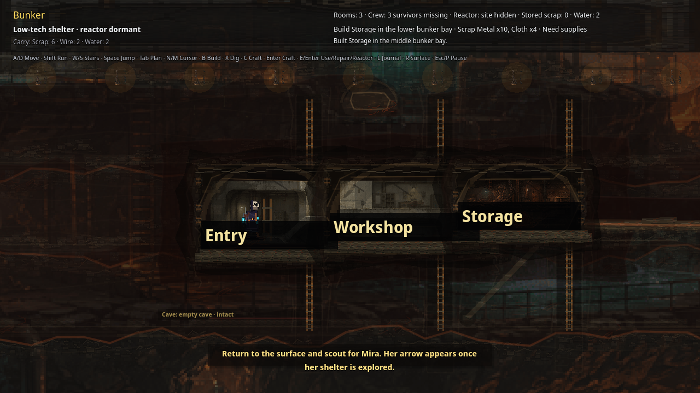

# Realm 1 Public Release First Build Smoke

Status: public release first-objective bunker build UI smoke proof. This does **not** replace external unaided QA, art/audio review, or legal/store approval.

Verified on 2026-07-03 from the public support-repo release zip after redownload and SHA check:

- Release: <https://github.com/elias-leslie/the-aftertimes-support/releases/tag/realm1-review-a5392e7c>
- Asset: <https://github.com/elias-leslie/the-aftertimes-support/releases/download/realm1-review-a5392e7c/the-aftertimes-realm1-linux-a5392e7c.zip>
- Zip SHA256: `4d25cd74e4212de86dd64c7e3fa9b4144d267b31d47192af3def51c276c0904e`
- Executable SHA256: `3154bb4465f616e24b811dd576e9230022872cd80f8d5ab854efed2716b926d4`
- PCK SHA256: `32a7d59ab5b556f0afc8725364f8f237ba9a39ca6ecd5d741222eaaa249689da`
- Before-build screenshot SHA256: `68159665179f223507127287cab93010bb4d5097df3fbc6fd61c0db5034f14a0`
- First-build screenshot: <https://github.com/elias-leslie/the-aftertimes-support/blob/main/public-release-first-build-ui-smoke.png>
- First-build screenshot SHA256: `0cc0742075f512451e6af54c3c68971f2a41e7a4df57f8007d0b90d7cec99389`
- Runtime mode: launched the extracted public Linux executable under Xvfb at 1280x720 from a fresh temp profile, used keyboard input to reach playable bunker UI, pressed `B` on the initial `Build Storage` prompt, and captured the built Storage room.

Visible result: the published public release asset builds the first Storage room and renders `Rooms: 3`, `Storage`, `Built Storage in the middle bunker bay.`, and the post-build objective `Return to the surface and find Mira.`

Reviewers should still run the game normally and submit verdicts through the public tracker issues. Paid launch remains blocked until the public trackers record PASS or accepted MIXED/deferral decisions.
