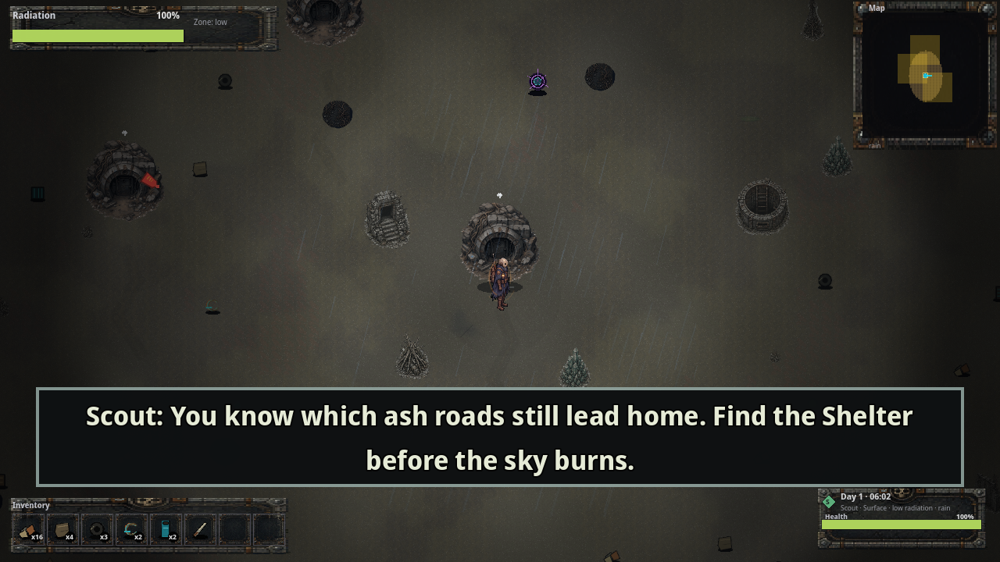

# Realm 1 Public Release Gameplay Entry Smoke

Status: public source-fresh `35a52259` UI smoke proof. This does **not** replace external unaided QA, art/audio review, or legal/store approval.

Verified on 2026-07-07 from the public repo-hosted support ZIP after redownload and SHA check:

- Repo-hosted Linux review zip: <https://github.com/elias-leslie/the-aftertimes-support/raw/main/downloads/the-aftertimes-realm1-linux-35a52259.zip>
- Download file in repository: <https://github.com/elias-leslie/the-aftertimes-support/blob/main/downloads/the-aftertimes-realm1-linux-35a52259.zip>
- ZIP SHA256: `32b9dbdfcb1ccb77ac527e59bc6ee8f6aa6ff8bda6bb9a01ea4b2ad7bfbae6dd`
- Executable SHA256: `3154bb4465f616e24b811dd576e9230022872cd80f8d5ab854efed2716b926d4`
- PCK SHA256: `bbf55141c3851fe943be43c503e8dc16158c8edbec3fe5e3948315d40754ec3f`
- Runtime/export commit: `35a52259`
- Title screenshot SHA256 before input: `01f6c793a1c28810f8b7c2abcb58bcec4a2b55681ee9403cd06678a0924d552e`
- Class-select screenshot SHA256 before gameplay entry: `1d3a7234972d0586a1b2f188b2e80bbacdc666fb4e6816a22bba311b2dbd6e94`
- Gameplay-entry screenshot: <https://github.com/elias-leslie/the-aftertimes-support/blob/main/public-release-gameplay-entry-ui-smoke.png>
- Gameplay-entry screenshot SHA256: `5c0bfa073f9919792e1085f001a725b71219c457484a00985396d9ccde3b8bd2`
- Runtime mode: launched the extracted public Linux executable under Xvfb at 1280x720 from a fresh temp profile, pressed `Return` on `Wake the Shelter`, let class-select settle, sent `Return` to confirm Scout, waited for surface gameplay, and captured the first playable surface screen.

Visible result: the current repo-hosted public package leaves the title/class-select UI and renders top-down surface gameplay with `Radiation`, `Map`, `Inventory`, `Day 1`, the Scout HUD, rain, the bunker entrance, and the Scout intro objective text visible.

Reviewers should still run the game normally and submit verdicts through the public tracker issues. Paid launch remains blocked until the public trackers record PASS or accepted MIXED/deferral decisions.
