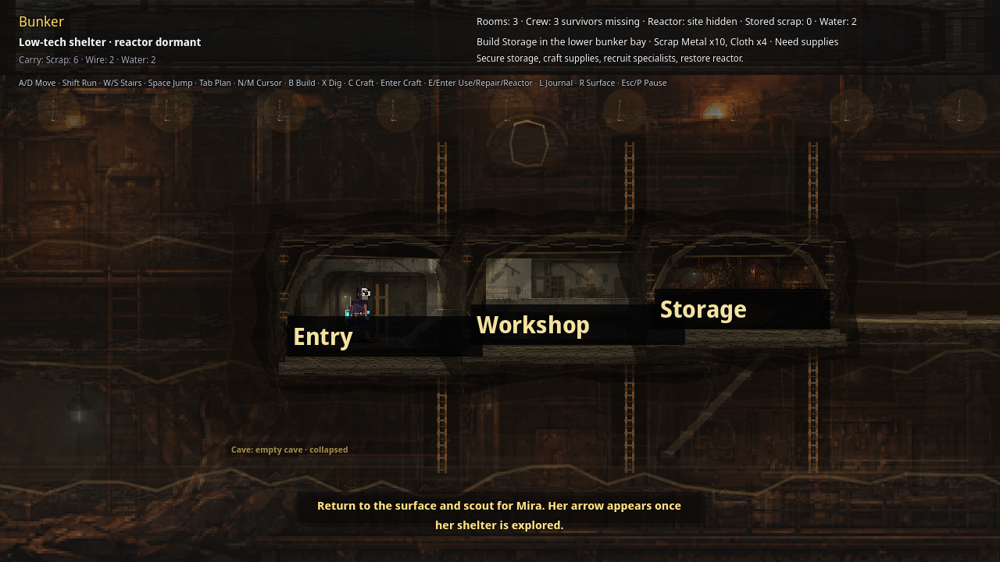

# Realm 1 Public Package Save / Continue Smoke

Status: public package save/Continue UI smoke proof. This does **not** replace external unaided QA, art/audio review, or legal/store approval.

Verified on 2026-07-07 from the public repo-hosted source-fresh Linux review zip after redownload and SHA check:

- Repo-hosted Linux review zip: <https://github.com/elias-leslie/the-aftertimes-support/raw/main/downloads/the-aftertimes-realm1-linux-682a0eb2.zip>
- Download file in repository: <https://github.com/elias-leslie/the-aftertimes-support/blob/main/downloads/the-aftertimes-realm1-linux-682a0eb2.zip>
- ZIP SHA256: `432d450275e7e42f7b000c8a9e4b7d488c8bf72e273d4638f89d395144f2b719`
- ZIP bytes: `63,382,521`
- Runtime/export commit: `682a0eb2`
- Executable SHA256: `3154bb4465f616e24b811dd576e9230022872cd80f8d5ab854efed2716b926d4`
- PCK SHA256: `0b1f2e59564ffeb6b4055e0ae6e56e11b3df6b2d365f8260a885260add24c671`
- Storage-built screenshot SHA256: `d773977a08744e1819104ab6907f565b95c0686b3a4c84acaa863790a267b7ca`
- Saved pause-menu screenshot SHA256: `b1d8dd215175d298f546d5fca062fc483b57db634e1c881a17b3e25917b9f21b`
- Title-after-quit screenshot SHA256: `df8cae6ccbf8391bf73b58d2404c6cc5e8d5bc67fb9c7dd27ec45fe2bb5ae41a`
- Loaded-bunker screenshot: <https://github.com/elias-leslie/the-aftertimes-support/blob/main/public-release-save-continue-smoke.png>
- Loaded-bunker screenshot SHA256: `5bcc4ccc92f66cac597926090b02d2772bfdc28882cb6eee00cbb7168b834015`
- Save/Continue contact sheet: <https://github.com/elias-leslie/the-aftertimes-support/blob/main/public-save-continue-682a0eb2-contact.png>
- Save/Continue contact sheet SHA256: `0fdcbb70e3d4cc218d663a0dcfaed8bc5e2f693ac7c6c105ba8cbd4b3bbf6452`
- Source-local runtime proof log SHA256: `7d9303ed89705dfe6ef6140fc72a8f21d941950a73f2dd867cd9bd91c96ca460`
- Save-file check: `save_autosave.json` existed in a fresh temp profile, `current_realm_id` was `aftertimes`, and saved base rooms were `entry,workshop,storage`.
- Runtime mode: launched the extracted public Linux executable under Xvfb at 1280x720 from a fresh temp profile, used keyboard input to reach playable bunker UI, built Storage with `B`, opened pause, selected **Save Shelter Record**, quit to title, selected **Continue**, and captured the loaded bunker state.

Visible result: after Continue, the public `682a0eb2` package returns to the bunker with `Rooms: 3`, `Entry`, `Workshop`, `Storage`, the current Storage -> Mira tutorial prompt, and the same carried supplies visible. The title screen before Continue showed `Continue: The AfterTimes · bunker`.

Reviewers should still run the game normally and submit verdicts through the public tracker issues. Paid launch remains blocked until the public trackers record PASS or accepted MIXED/deferral decisions.
