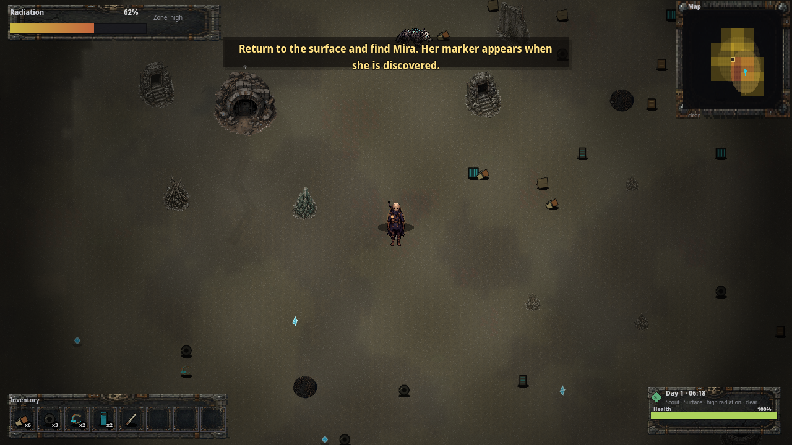

# Realm 1 Public Release Surface Movement Smoke

Status: public release surface-movement UI smoke proof. This does **not** replace external unaided QA, art/audio review, or legal/store approval.

Verified on 2026-07-03 from the public support-repo release zip after redownload and SHA check:

- Release: <https://github.com/elias-leslie/the-aftertimes-support/releases/tag/realm1-review-d3fc7d09>
- Asset: <https://github.com/elias-leslie/the-aftertimes-support/releases/download/realm1-review-d3fc7d09/the-aftertimes-realm1-linux-d3fc7d09.zip>
- Zip SHA256: `5bfc0816d402dd94bfe0db16a36d283a55b63328581cc8a29f3b94245eb425fa`
- Executable SHA256: `3154bb4465f616e24b811dd576e9230022872cd80f8d5ab854efed2716b926d4`
- PCK SHA256: `6c5ef6daebfa5b7b3701d750cac1203bac023cafbc9ec4f98fac34e7a0f1d0f8`
- Before-movement screenshot SHA256: `799bc065df2adda95ec9d21744e1ed6b65fe68e41257bf261e0fbb417aa30c1e`
- Surface-movement screenshot: <https://github.com/elias-leslie/the-aftertimes-support/blob/main/public-release-surface-movement-ui-smoke.png>
- Surface-movement screenshot SHA256: `d7f4d9baae46e7cf097716c68841422141c9f62b1b816b45be31f600f37484ba`
- Runtime mode: launched the extracted public Linux executable under Xvfb at 1280x720 from a fresh temp profile, used keyboard input to reach playable bunker UI, built Storage with `B`, pressed `R` to return to the surface, held `D` then `S`, and captured surface gameplay after movement.

Visible result: the before screenshot shows the player at the bunker entrance with `E/Enter Open bunker`; the movement screenshot shows the player displaced south-east from the bunker, the bunker prompt gone, the minimap marker shifted, and the surface HUD still rendering `Radiation`, `Map`, `Inventory`, `Day 1`, and `Health`.

Reviewers should still run the game normally and submit verdicts through the public tracker issues. Paid launch remains blocked until the public trackers record PASS or accepted MIXED/deferral decisions.
