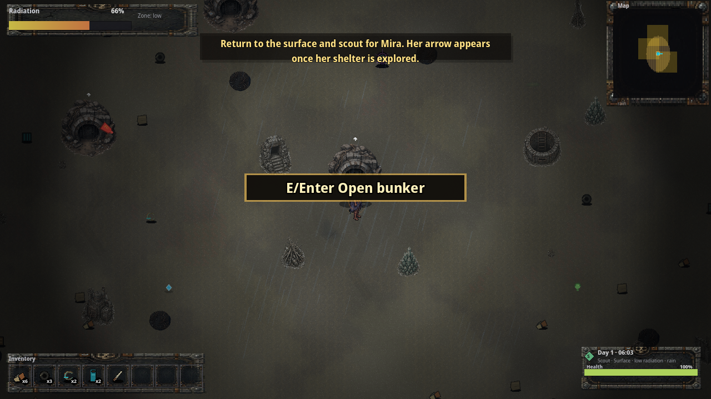

# Realm 1 Public Release Surface Return Smoke

Status: public source-fresh `35a52259` UI smoke proof. This does **not** replace external unaided QA, art/audio review, or legal/store approval.

Verified on 2026-07-07 from the public repo-hosted support ZIP after redownload and SHA check:

- Repo-hosted Linux review zip: <https://github.com/elias-leslie/the-aftertimes-support/raw/main/downloads/the-aftertimes-realm1-linux-35a52259.zip>
- Download file in repository: <https://github.com/elias-leslie/the-aftertimes-support/blob/main/downloads/the-aftertimes-realm1-linux-35a52259.zip>
- ZIP SHA256: `32b9dbdfcb1ccb77ac527e59bc6ee8f6aa6ff8bda6bb9a01ea4b2ad7bfbae6dd`
- Executable SHA256: `3154bb4465f616e24b811dd576e9230022872cd80f8d5ab854efed2716b926d4`
- PCK SHA256: `bbf55141c3851fe943be43c503e8dc16158c8edbec3fe5e3948315d40754ec3f`
- Runtime/export commit: `35a52259`
- Built-Storage screenshot SHA256 before return: `201849b1368e06ebdbe3946c286312ea959e76f741aadf6517b782d57789fb88`
- Surface-return screenshot: <https://github.com/elias-leslie/the-aftertimes-support/blob/main/public-release-surface-return-ui-smoke.png>
- Surface-return screenshot SHA256: `7836d3f526b71ca682b9bc9aa0d44ff979fc3b2b115d11f6dccbe2b8d858a9dd`
- Runtime mode: launched the extracted public Linux executable under Xvfb at 1280x720 from a fresh temp profile, used keyboard input to reach surface gameplay, entered the bunker with `E`, built Storage with `B`, pressed `R` to return to the surface, waited for the transition, and captured surface gameplay.

Visible result: the current repo-hosted public package returns from the built bunker to surface gameplay and renders `Radiation`, `Map`, `Inventory`, `Day 1`, `E/Enter Open bunker`, and the updated objective `Return to the surface and scout for Mira. Her arrow appears once her shelter is explored.`

Reviewers should still run the game normally and submit verdicts through the public tracker issues. Paid launch remains blocked until the public trackers record PASS or accepted MIXED/deferral decisions.
