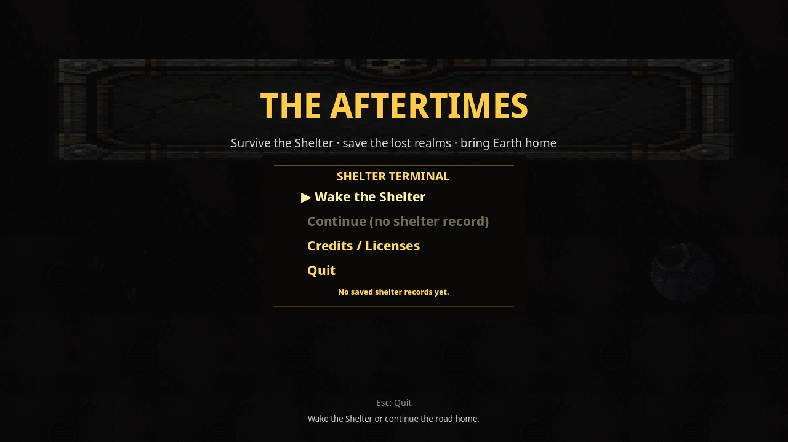

# Realm 1 Public Release UI Smoke

Status: public release UI smoke proof. This does **not** replace external unaided QA, art/audio review, or legal/store approval.

Verified on 2026-07-03 from the public support-repo release zip after redownload and SHA check:

- Release: <https://github.com/elias-leslie/the-aftertimes-support/releases/tag/realm1-review-28b02d4d>
- Asset: <https://github.com/elias-leslie/the-aftertimes-support/releases/download/realm1-review-28b02d4d/the-aftertimes-realm1-linux-28b02d4d.zip>
- Zip SHA256: `5edeb25c0f80cd2a8a84fd061c790acadf31a9da04c86cb4b5a337bdfa5b4e33`
- Executable SHA256: `3154bb4465f616e24b811dd576e9230022872cd80f8d5ab854efed2716b926d4`
- PCK SHA256: `361db6d98ba211ffd5e1a769bb5867fc2b5bd161abeaf298616bafae463e0fac`
- UI smoke screenshot: <https://github.com/elias-leslie/the-aftertimes-support/blob/main/public-release-title-ui-smoke.png>
- UI screenshot SHA256: `01f6c793a1c28810f8b7c2abcb58bcec4a2b55681ee9403cd06678a0924d552e`
- Runtime mode: launched the extracted public Linux executable under Xvfb at 1280x720 and captured the visible title screen.

Visible result: title menu renders `THE AFTERTIMES`, `Wake the Shelter`, `Credits / Licenses`, and no saved shelter records from a fresh temp profile.

Reviewers should still run the game normally and submit verdicts through the public tracker issues. Paid launch remains blocked until the public trackers record PASS or accepted MIXED/deferral decisions.
